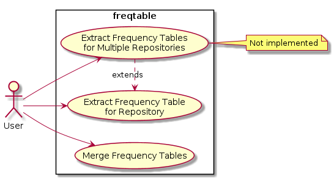
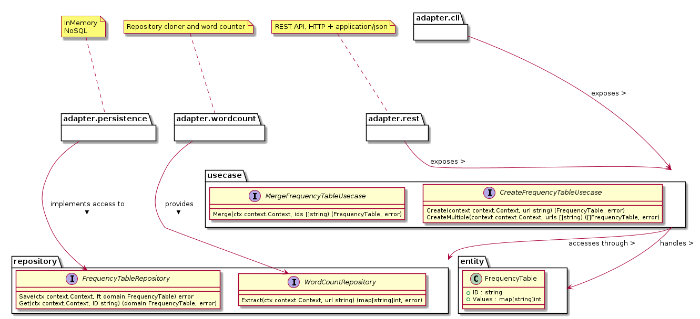
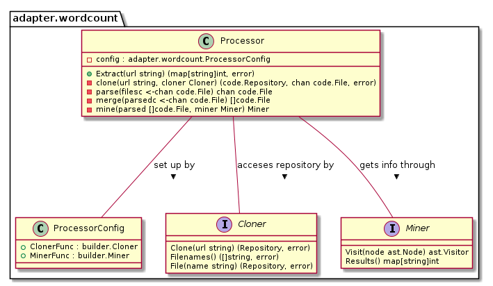

# freqtable
**freqtable** is a Frequency Table builder, which handles the extraction and counting of words (dictionary words) from Go source code.

## Use Cases

### Input & Output for extractions
The input for the process is a list of GitHub's public Golang source code repositories.
Since we don't use authentication to communicate to GitHub's API, we only use public available repositories.

The output after the frequency table builder execution is a plain-text file (comma-separated value, by default), which contains the following information per row:

- repository
- word
- count

The resulting file may contain a high number of rows, but it will allow us to determine and analyze each project's impact.

## Class/Package diagram

### WordCounter class diagram

The most complex repository implementation is the WordCounter implementation, so a diagram is included to show structs, interfaces and their relationships.

## License

See the [LICENSE](LICENSE) file for license rights and limitations (MIT).
