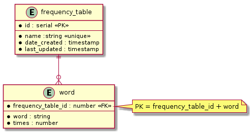

# freqtable

**freqtable** is a Frequency Table builder, which handles the extraction and counting of words (dictionary words) from Go source code.

## Use Cases

### Input & Output for extractions

**freqtable** exposes a REST API to create frequency tables. It receives the name of the repository and extract the word count.
This word count is stored in a database and can then be summarized to create a global frequency table.

The input for the process is a GitHub's public Golang source code repository name.
Since we don't use authentication to communicate to GitHub's API, we only use public available repositories.
The response indicates if it could be processed or not, but it won't return the resulting pairs (key-value).

## Class/Package diagram

### WordCounter class diagram

The most complex repository implementation is the WordCounter implementation, so a diagram is included to show structs, interfaces and their relationships.

## Database schema

## Technical Debt

* Complete missing use cases.
* Improve logging and error handling through the _Clean Architecture_ rings.
* Improve container initialization, perhaps using factories and allowing select underlying storages at initialization time.
* Capture logs and send them to ElasticSearch (and make them available through Kibana).
* Use metrics collector to check the app status.

## License

See the [LICENSE](LICENSE) file for license rights and limitations (MIT).
